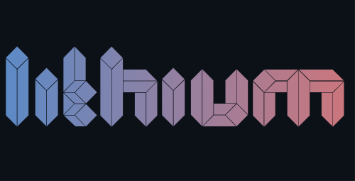

<p align="center">
  
</p>

---

Lithium Unblocker is a fork of Utopia, it unblocks hundreds of millions of websites and bypasses web restrictions with ease.
The most revolutionary proxy service out there, adding unprecendented technology and algorithms to circumvent blocks.

Trusted by over **no users** and counting.

## Special Features
These features can be enabled/disabled in the Settings page in Lithium:
 * **🔒 Hidden Mode**
   * Lithium revolutionized the world by being the first ever website to have about:blank cloaking
   * **Hides Lithium completely from your history** and **prevents extensions** such as GoGuardian **from seeing your screen**
 * **🚫 Anti-Closing**
   - Prevents extensions such as GoGuardian from closing the tab you're on
 * **🎭 Tab Cloak**
   - Disguises the tab you're on as something else, such as Google Classroom, Drive, Gmail, etc.
 * **⚡ Quick Links**
   * Access websites faster than ever with a click of a button
 * **🎨 Themes**
   * Personalize Lithium with countless high-quality themes
* **🔍 Search Engine**
   * Switch between Google, DuckDuckGo, and more.
* **📑 Tabs System**
   * See site URL, title, and icon while browsing for smoother navigation.
* **🚫 Experimental Ad Blocker**
   * Blocks ads globally, meaning a faster and privacy-focused browing experience.
* **🛠 Dev Tools**
   * Access an integrated dev panel by clicking the ⚙️ icon while browsing.
* **And more to come...**

---
## 📦 Deployment
Easily deploy your own instance of Lithium using one of the platforms below:


### Manual Setup
```bash
# Clone the repository
git clone https://github.com/nivalox/Lithium.git
cd Lithium

# Install dependencies
npm install

# Start the server
npm start
```

---
## 💬 Community & Support
Need help deploying or want to suggest features?
- Join the official Discord: https://discord.gg/KE6N35ySmK

---
<p align="center">
  <strong>⭐ Star this repository if Lithium helps you!</strong>
</p>
